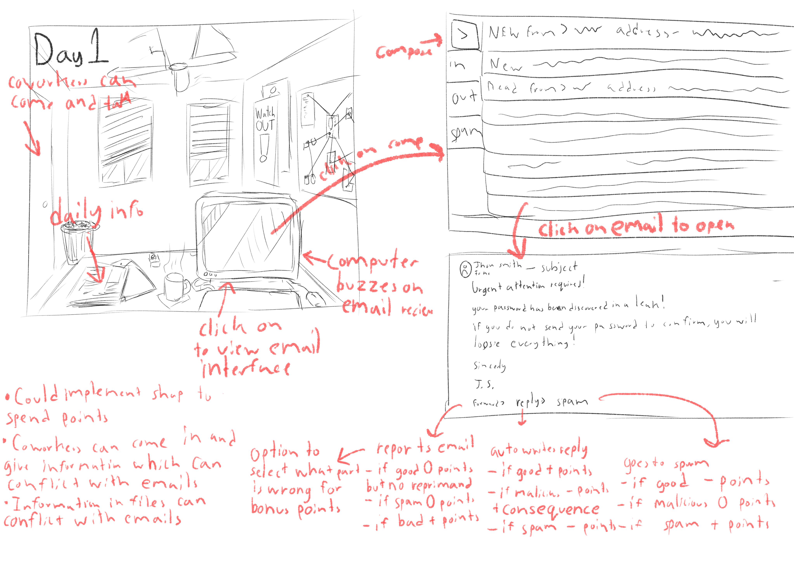

# REPLACE THIS WITH YOUR GAME NAME

## Elevator Pitch

Replace this with a one sentence pitch for your game. Pretend that your were pitching your game to a executive going to the elevator, and you only had 60 seconds. You should not write more than a few sentences at most. Check [this resource](http://www.gameacademy.com/perfecting-indie-games-elevator-pitch/) for more information.

## Influences (Brief)

- *Influence #1*:
  - Medium: *(Television, Games, Literature, Movies, etc.)*
  - Explanation: *In one paragraph or less, explain why this is an influence.*
- *Influence #2*:
  - Medium: *(Television, Games, Literature, Movies, etc.)*
  - Explanation: *In one paragraph or less, explain why this is an influence.*
- *Influence #3*:
  - Medium: *(Television, Games, Literature, Movies, etc.)*
  - Explanation: *In one paragraph or less, explain why this is an influence.*

## Core Gameplay Mechanics (Brief)

*Give a very high-level description of any core gameplay mechanics*

- *Gameplay Mechanic #1*
- *Gameplay Mechanic #2*
- *Gameplay Mechanic #3*
- *Gameplay Mechanic #4*

# Learning Aspects

## Learning Domains

*Briefly list any and all of the disciplines and learning domains for this subject.*

## Target Audiences

*Who are your learners?*

## Target Contexts

*Describe what kinds of formal and informal learning contexts this will be used in (e.g., courses, k-12 computer labs during free time).*

## Learning Objectives

*Remember, Learning Objectives are NOT simply topics. They are statements of observable behavior that a learner can do after the learning experience. You cannot observe someone "understanding" or "knowing" something.*

- *Short Name*: *Formal Learning Objective #1*
- *Short Name*: *Formal Learning Objective #2*
- *Short Name*: *Formal Learning Objective #3*

## Prerequisite Knowledge

*What do they need to know prior to trying this game?*

- *Prerequisite Learning Objective #1*
- *Prerequisite Learning Objective #2*

## Assessment Measures

*Clearly identify a set of viable assessment questions AND their grading logic. The questions should be specific examples of the kinds of questions that your game could conceivably improve student performance on. For the grading logic, it could be the correct answer, a rubric for evaluating the answer, or exact logic for deriving answers.*

# What sets this project apart?

*Give some reasons why this game is not like every other game out there. Whether the learning objective is unique, the gameplay mechanics are new, or what. You should persuade the reader that your game is novel and worthy of development. Consider arguments that would be persuasive to a Venture Capitalist, Teacher, or Researcher. These might be focused on learning needs, too.*

- *Reason #1*
- *Reason #2*
- *Reason #3*
- *Reason #4*
- *etc.*

# Player Interaction Patterns and Modes

## Player Interaction Pattern

*Describe how people play your game, how many players are involved at once, how they interact with the system works, etc.*

## Player Modes

*Your game has one or more player modes. Describe each discrete mode, considering things like menus too. Generally describe the transitions between modes too.*

- *Player mode #1*: *Description*
- *Player mode #2*: *Description*
- *etc.*

# Gameplay Objectives

- *Primary Objective #1*:
    - Description: *Description*
    - Alignment: *Describe how this aligns with one or more learning objectives*
- *Primary Objective #2*:
    - Description: *Description*
    - Alignment: *Describe how this aligns with one or more learning objectives*
- *etc.*

# Procedures/Actions

*Describe the control scheme and what actions a user can take in the game.*

# Rules

*What resources are available to the player that they make use of?  How does this affect gameplay? How are these resources finite?*

# Objects/Entities

*What other things are in the world that you need to design? These may or may not directly translate to actual objects and classes.*

## Core Gameplay Mechanics (Detailed)

- *Core Gameplay Mechanic #1*: *Describe in 2 paragraphs or less, along with how it generally works*
- *Core Gameplay Mechanic #2*: *Describe in 2 paragraphs or less, along with how it generally works*
- *Core Gameplay Mechanic #3*: *Describe in 2 paragraphs or less, along with how it generally works*

    
## Feedback

*Explicitly describe what visual/audio/animation indicators there are that give players feedback on their progress towards their gameplay objectives (and ideally the learning objectives).*

*Describe what longer-term feedback you detect and give that guides the player in their learning and lets them know how they are doing in regards to the learning objectives.*

# Story and Gameplay

## Presentation of Rules

*Briefly describe how the player will learn the gameplay mechanics. Avoid using walls of text, since people will not read them. Think instead of natural ways of teaching mechanics iteratively and slowly.*

## Presentation of Content

*Briefly describe how the player will be taught the core material they are meant to learn. Avoid using walls of text, since people will not read them. Think instead of natural ways of teaching material iteratively and slowly.*

## Story (Brief)

*Youa are working at a detective agency in the mid 90s and you are tasked with sorting through incoming emails to and from within the agency to determine whether they are phishing, spam, official, or malicious. Through this a mystery of some sort will be uncovered as you gain information through files, emails, and hushed conversations.*

## Storyboarding

# Assets Needed

## Aethestics

*The game will be set in a dingy run down corner office in a small detective center downtown in the mid 90s. The room will feel dusty and old, the fan slowly spinning and creaking, rays of yellow light will shine through the windows and change as the day goes forward. Coworkers will come in throughout the day to make small talk, drop off important files, or reprimand you for making an incorrect decision. The 2d background will either be hand drawn or pixel art.*

## Graphical

- Characters List
  - *Player (first person)*
  - *Random Coworkers*
  - *Chief*
  - *Security*
- Textures:
  - *The game will be solely 2d background with hitboxes for click*
- Environment Art/Textures:
  - *A drawn version of something like this*

  - *The player will be using a computer like this*

## Audio

*Game region/phase/time are ways of designating a particularly important place in the game.*

- Music List (Ambient sound)
  - *Sitting at desk*: *https://www.youtube.com/watch?v=6-_oEkN1W5s*, *https://www.youtube.com/watch?v=eH-_GMhH-kk*
  - *Shop*: *https://www.youtube.com/watch?v=HV6sYbGqCxI&t=3573s*
  
*Game Interactions are things that trigger SFX, like character movement, hitting a spiky enemy, collecting a coin.*

- Sound List (SFX)
  - *Clicking on compiter, emails, responding*: *https://www.epidemicsound.com/sound-effects/tracks/a3d66b9e-560f-47d2-a25a-c72763944d4a/*, *https://www.epidemicsound.com/sound-effects/tracks/98fca212-6ea7-417b-bab1-c482d79893e8/*
  - *Looking through files (physical)*: *https://www.epidemicsound.com/sound-effects/tracks/447060c0-df0a-4085-a73f-5c4209280e0e/*, *https://www.epidemicsound.com/sound-effects/tracks/f474d945-02b7-4f36-b023-c172f15b1d6d/*

# Metadata

* Template created by Austin Cory Bart <acbart@udel.edu>, Mark Sheriff, Alec Markarian, and Benjamin Stanley.
* Version 0.0.3
